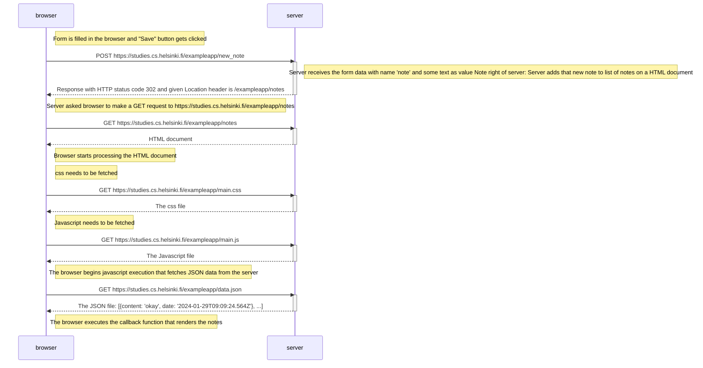

```mermaid
sequenceDiagram
    participant browser
    participant server

    Note right of browser: Form is filled in the browser and "Save" button gets clicked

    browser->>server: POST https://studies.cs.helsinki.fi/exampleapp/new_note
    activate server
    Note right of server: Server receives the form data with name 'note' and some text as value Note right of server: Server adds that new note to list of notes on a HTML document
    server-->>browser: Response with HTTP status code 302 and given Location header is /exampleapp/notes
    deactivate server

    Note right of browser: Server asked browser to make a GET request to https://studies.cs.helsinki.fi/exampleapp/notes

    browser->>server: GET https://studies.cs.helsinki.fi/exampleapp/notes
    activate server
    server-->>browser: HTML document
    deactivate server

    Note right of browser: Browser starts processing the HTML document

    Note right of browser: css needs to be fetched

    browser->>server: GET https://studies.cs.helsinki.fi/exampleapp/main.css
    activate server
    server-->>browser: The css file
    deactivate server

    Note right of browser: Javascript needs to be fetched

    browser->>server: GET https://studies.cs.helsinki.fi/exampleapp/main.js
    activate server
    server-->>browser: The Javascript file
    deactivate server

    Note right of browser: The browser begins javascript execution that fetches JSON data from the server

    browser->>server: GET https://studies.cs.helsinki.fi/exampleapp/data.json
    activate server
    server-->>browser: The JSON file: [{content: 'okay', date: '2024-01-29T09:09:24.564Z'}, ...]
    deactivate server

    Note right of browser: The browser executes the callback function that renders the notes
```