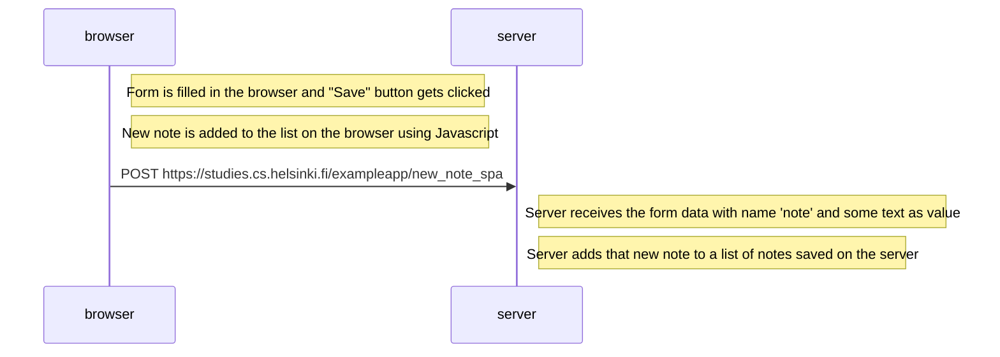

```mermaid
sequenceDiagram
    participant browser
    participant server

    Note right of browser: Form is filled in the browser and "Save" button gets clicked

    Note right of browser: New note is added to the list on the browser using Javascript

    browser->>server: POST https://studies.cs.helsinki.fi/exampleapp/new_note_spa

    Note right of server: Server receives the form data with name 'note' and some text as value
    Note right of server: Server adds that new note to a list of notes saved on the server
```