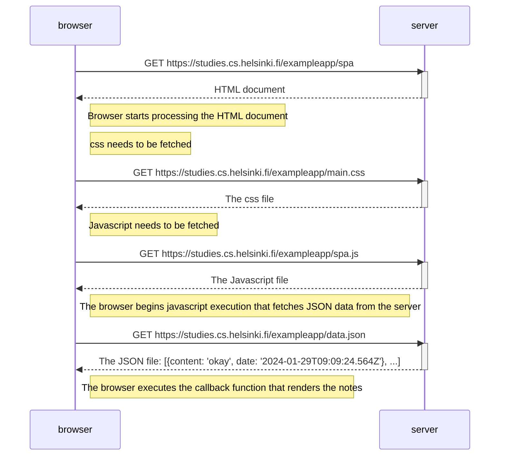

```mermaid
sequenceDiagram
    participant browser
    participant server

    browser->>server: GET https://studies.cs.helsinki.fi/exampleapp/spa
    activate server
    server-->>browser: HTML document
    deactivate server

    Note right of browser: Browser starts processing the HTML document

    Note right of browser: css needs to be fetched

    browser->>server: GET https://studies.cs.helsinki.fi/exampleapp/main.css
    activate server
    server-->>browser: The css file
    deactivate server

    Note right of browser: Javascript needs to be fetched

    browser->>server: GET https://studies.cs.helsinki.fi/exampleapp/spa.js
    activate server
    server-->>browser: The Javascript file
    deactivate server

    Note right of browser: The browser begins javascript execution that fetches JSON data from the server

    browser->>server: GET https://studies.cs.helsinki.fi/exampleapp/data.json
    activate server
    server-->>browser: The JSON file: [{content: 'okay', date: '2024-01-29T09:09:24.564Z'}, ...]
    deactivate server

    Note right of browser: The browser executes the callback function that renders the notes
```